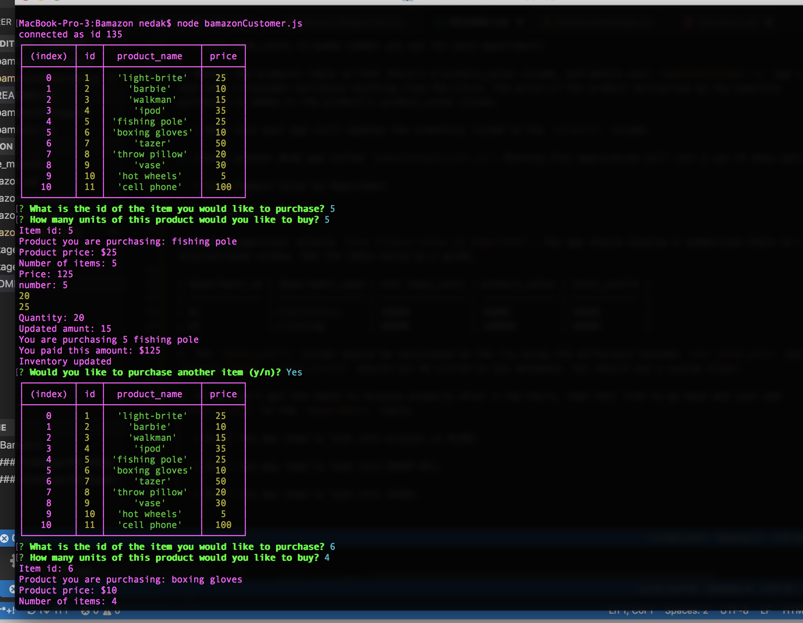
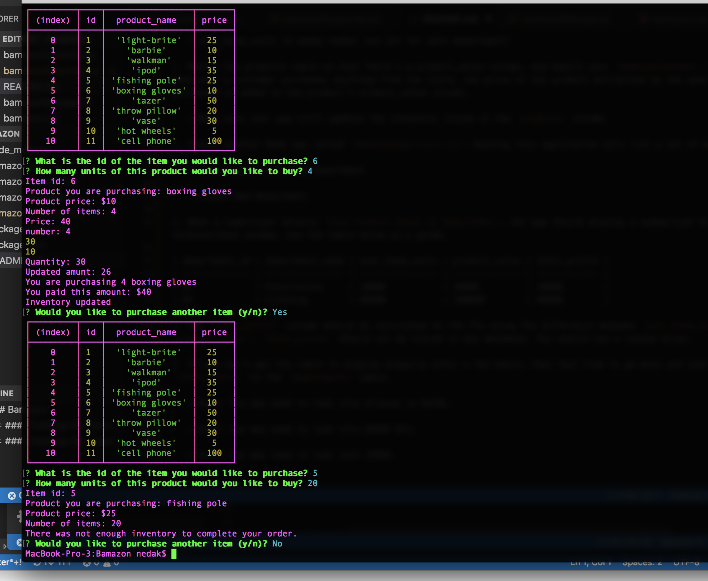
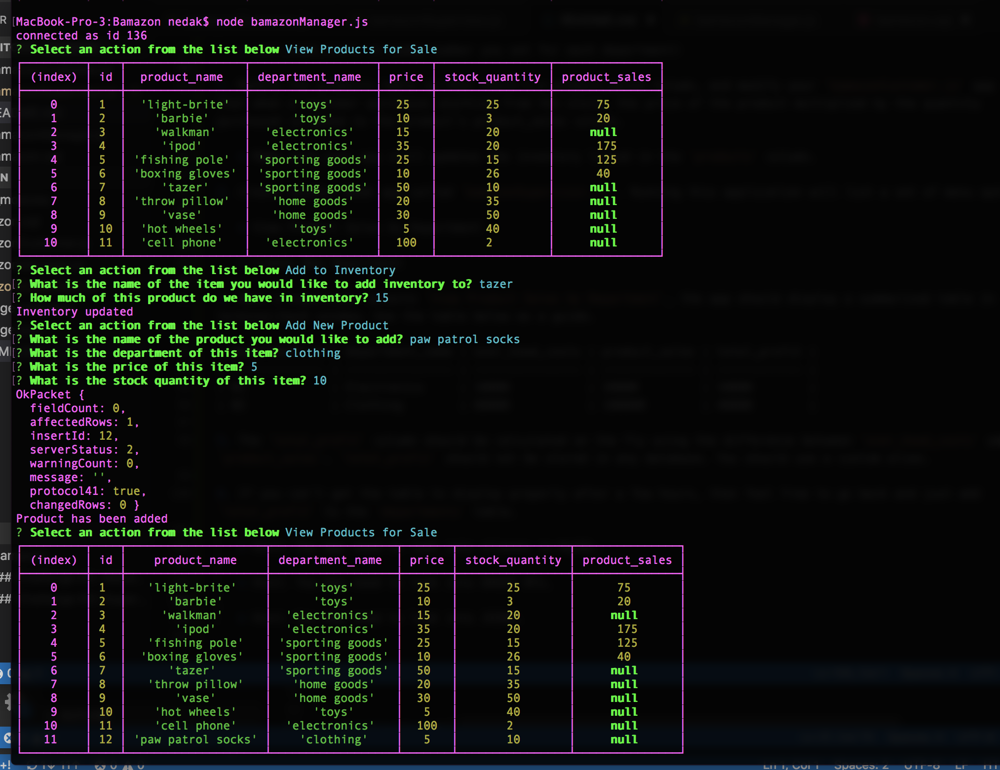
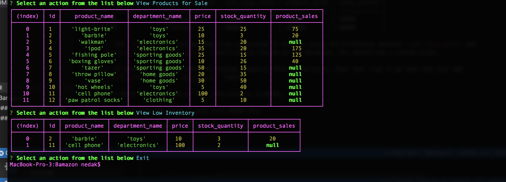
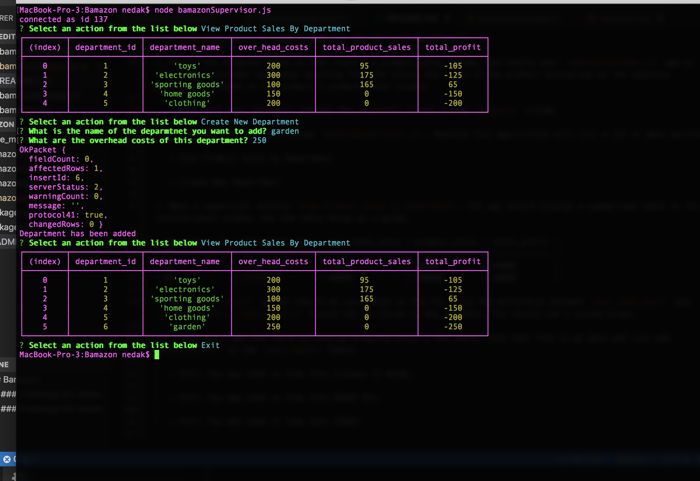

# Bamazon

 * This app works in conjunction with a MySQL Database called `bamazon`.

 * `Bamazon` has two tables, one called `products` and another called `departments`.

 *  The products table should have each of the following columns:

   * item_id (unique id for each product)

   * product_name (Name of product)

   * department_name

   * price (cost to customer)

   * stock_quantity (how much of the product is available in stores)
   * product_sales

* The departments table should have the following items:
     * department_id

     * department_name

     * over_head_costs (A dummy number you set for each department)

There are 3 levels to this Node application - Customer, Manager, and Supervisor.

##CUSTOMER -  node bamazonCustomer.js

    1.  Running this application will first display all of the items available for sale. Included will be the ids, names, and prices of products for sale.

    2. The will then prompt users with two messages.

     * The first should ask them the ID of the product they would like to buy.
     * The second message should ask how many units of the product they would like to buy.

    3.  Once the customer has placed the order, your application will check if the store has enough of the product to meet the customer's request.

        * If not, the app will log a phrase like `Insufficient quantity!`, and then prevent the order from going through.

    4.  However, if the store does have enough of the product, the customer's order will be fulfilled.
         * The SQL database will be updated to reflect the remaining quantity.
         * Once the update goes through, the customer will see the total cost of their purchase.

- - -Check out these screenshots to see the Customer Level in action!

- - -

###  Manager - node bamazonManager.js

1. The app will first prompt the user with the following: 

    * View Products for Sale
    
    * View Low Inventory
    
    * Add to Inventory
    
    * Add New Product

2. If a manager selects `View Products for Sale`, the app will list every available item: the item IDs, names, prices, and quantities.

3. If a manager selects `View Low Inventory`, then it will list all items with an inventory count lower than five.

4. If a manager selects `Add to Inventory`, the app will display a prompt that will let the manager "add more" of any item currently in the store.

5. If a manager selects `Add New Product`, it will  allow the manager to add a completely new product to the store.

- - Check out these screenshots to see the Manager Level in action!

- - -

### Supervisor  - node bamazonSupervisor.js

1. Running this application will list a set of menu options:

   * View Product Sales by Department
   
   * Create New Department

2. When a supervisor selects `View Product Sales by Department`, the app should display a summarized table in their terminal/bash window showing department_id, department_name, over_head_costs, total_product_sales, and total_profit. 

3. The `total_profit` column is calculated on the fly using the difference between `over_head_costs` and        `total_product_sales`. 
4. The `total_product_sales` is calculated on the fly using the `product_sales` from all items in the same department.

- - Check out these screenshots to see the Supervisor Level in action!

- - -

